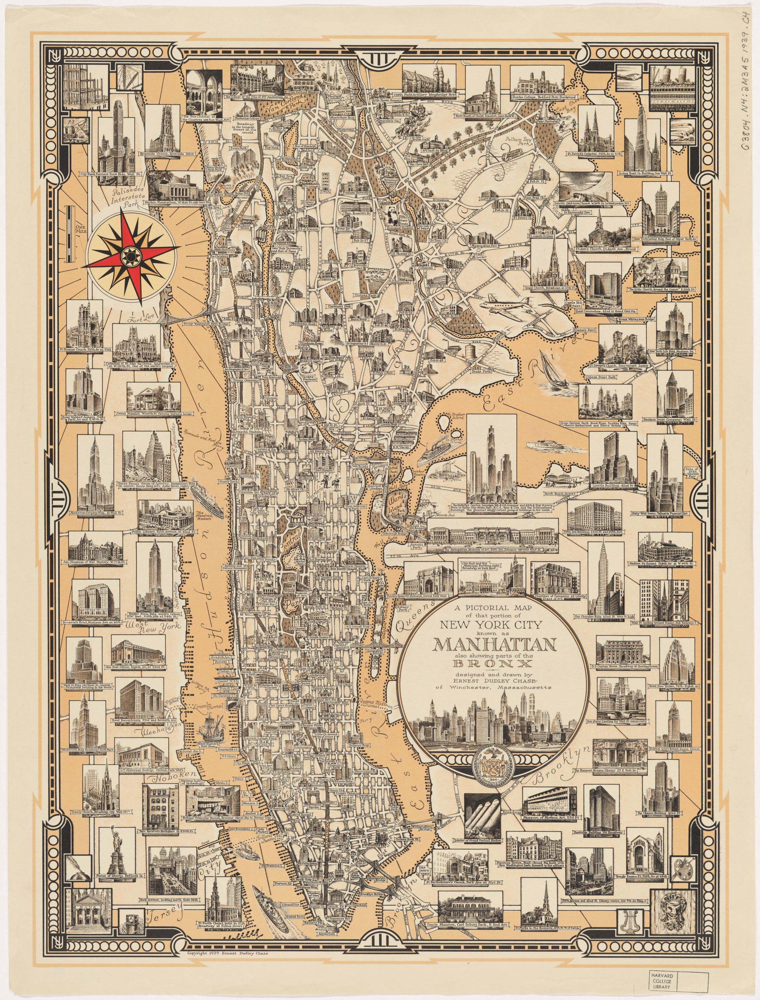

# Mapping Cultural Difference
The goal of this webpage is to allow others to follow the progress of this mapping project and understand the immediate and long-term goals and uses of the mapping project.

### About this mapping project
At its inception, this project's main goal is to demonstrate cultural distance and difference as they pertain to staged representations of Latinx (or Latine) Americans living in the United States. In order to do so, this project maps the difference between the spaces that are occupied by Latinx-Americans and Latinx immigrants and the spaces that represent or claim to represent Latinx Americans in the United States. For this initial stage of the project, this analysis is focused on the city of New York and shows data beginning in the 1940s and 1950s. The resulting map shows where Latines are living and the emergence of Latine community-centered theatres throughout the city of New York as Latine-Americans and Latine immigrants begin to create spaces for self-representation and community celebration. This map shows information gathered from census records, community organizing histories and theatre hubs based mostly in New York.

This project has been supported by the May-Crane Fellowship which allowed collaboration with, contribution to, and invaluable support from the Harvard Map Collection.

### Contents

1. Recurring Perspectives

2. Where Are All the New York Latines?

3. Where Are Latines Being Portrayed?

4. Reflections

5. Future Directions

## 1. Recurring Perspectives
... on the maps and in the theatre.

Upon arriving at and exploring the Harvard Map Collection, it quickly became evident that certain perpective have predominated mapmaking in New York. The focus of most maps in New York is commerce, and in more recent years this commerce is mainly prioritized in the form of tourism. 

The map above is a perspective map of Manhattan from the early 19th century which centers the southern tip of Manhattan and shipping commerce as the most notable features of the city. The northern part of Manhattan, as well as the areas that would come to be known as Brooklyn, Queens, the Bronx, and Staten Island are featured as marginal or not at all. While this map was created long before New York City became defined by the five boroughs, the parts left off the map or left literally minimized by the perspective of the map are the places that would come to be populated by people of color, including Latine immigrants.

The map below is dated to 1939, about a century after the map above. In this case, the map is not physically skewed to represent fincance and commerece. Rather, it points out locations that serve either as important financial institutions or as major attractions for those visiting from outside of the city. 

While New York has long been known for its status as a maor driver of the country's financial capital, a large fraction of the city's tax revenue is driven by tourism. According to the New York State Comptroller's Office, "spending by tourists is _the critical driver_ for industry employment, wages and tax revenues." _Source: [NYS Comptroller: Reigniting the Return](https://www.osc.state.ny.us/reports/osdc/tourism-industry-new-york-city)_

Within tourist spending, shows and other entertainment make up more than 10% of commerce. Theatre, entertainment, and concerts all fall in the same tourism category, but Broadway remains one of the most romanticized tourist attractions due to its historical association with the lights and color that many understand as synechdoche for New York City.
 

## 2. Where Are All the New York Latines
... and how come they're in these spaces?

- Lower East Side/Loisaida
- Upper West Side --> Washington Heights
- South Bronx
- Northern Queens
- Brooklyn

## 3. Where Are Latines Being Portrayed?
...and who is portraying them

## 4. Reflections

## 5. Next Steps and Future Directions

##### Markdown things to try
- [x] Try to make some text on this page **bold** by placing asterisks to either side.
- [x] Try making some text _italicized_ by placing underscores on either side of the text.
- [x] Trying creating an ordered and unordered list by using numbers and hyphens.
- [x] Try adding another photo.
- [x] Try creating a hyperlink out like the source link for the turtle facts.~~
- [x] So far, we have header 1s (the title "Turtles"), and header 2s ("Facts about turtles", "Famous turtles", etc.) Try adding a header 3 using `### `.
- [x] Are there any other [Markdown tasks](https://www.markdownguide.org/basic-syntax/) you want to try?

#### Resources
- [Basic markdown syntax](https://www.markdownguide.org/basic-syntax/)
- [HackMD.io shows how your markdown will display realtime](https://hackmd.io/)
- [Quickstart for Github Pages](https://docs.github.com/en/pages/quickstart)